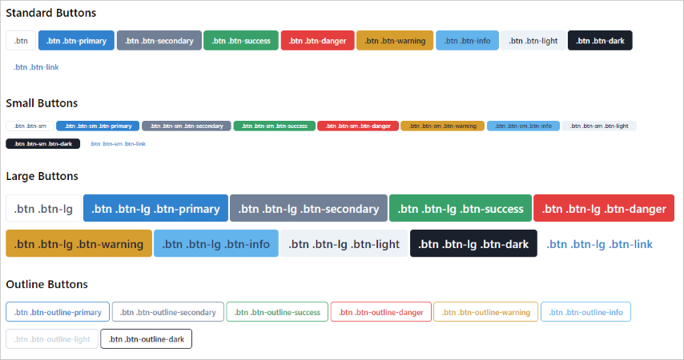
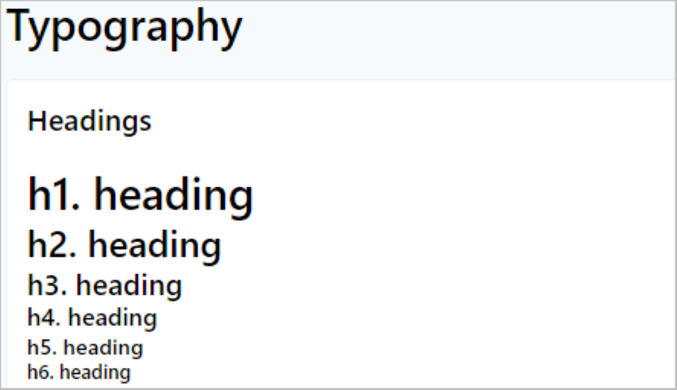

# Bootstrap drop in replacement for TailwindCSS

<div style="text-align: center;">


</div>

# The why?
I didn't want to "re-create" bootstrap, just make life a little easier...

Ever wrote a site for yourself or a client... then you discovered Tailwind?

Yeah... the pain is real. When we go down that rabbit hole of converting our site to tailwind, there is a lot to fix and change.

This package will fix the majority of those problems you face.

# Preview



There is more than just buttons and typography, view the demo below
## [Demo](https://scootersam.github.io/tailwindcss-bootstrap-replacement-demo)

<br>

# Install
1. Install the plugin

```bash
# Using npm
npm i tailwindcss-bootstrap-replacement --save-dev

# Using yarn
yarn add npm i tailwindcss-bootstrap-replacement -D
```
<br>
2. Add the plugin to your Tailwind config file

```javascript
module.exports = {
  future: {
    // removeDeprecatedGapUtilities: true,
    // purgeLayersByDefault: true,
  },
  purge: [
  ],
  theme: {    
  },
  variants: {},
  plugins: [
    require('tailwindcss-bootstrap-replacement')
  ],
}
```

# Credits
- [Adam Wathan](https://github.com/adamwathan) I used his [Tailwind Custom Forms](https://github.com/tailwindlabs/tailwindcss-custom-forms) plugin as a starting point for this plugin